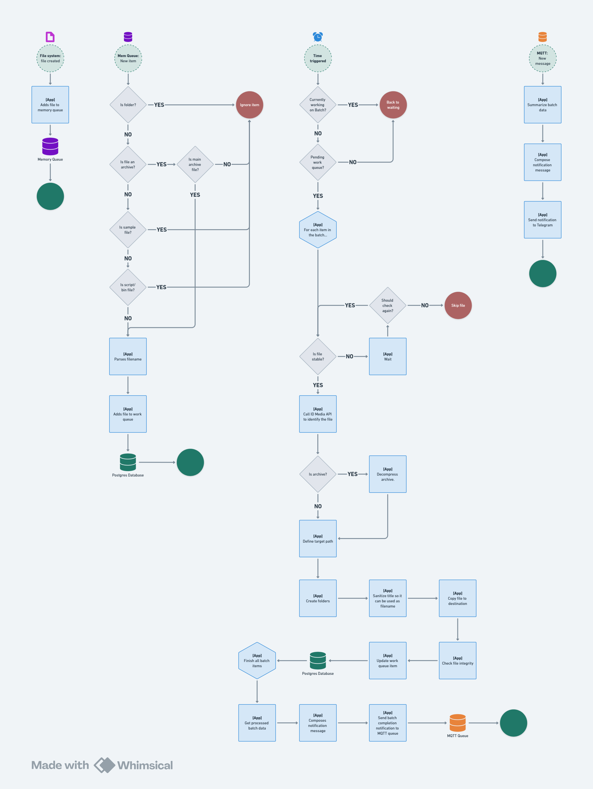

# Scene Media Organizer (SMO)

A Python-based file monitoring and media organization system that automatically processes video files and archives,
organizing them into structured directories based on media metadata.

### Request flow
The chart below shows a simplified, happy-path request flow.


## How does it work?
We have four major elements in this application:
1. File system monitor: Triggered whenever a file/folder is created.
2. Memory Queue: To temporarily hold the files that we receive in the events
3. Activity Tracker: Logs all the activity happening in the system, so it can be closely monitored.
4. MQTT Queue: To decouple the file processing from the notification system.

### File Processing
TODO: Add this.

### Notification System
TODO: Add this.

## Requirements

### External dependencies
- Postgres database
- [media identifier api](https://github.com/brenordv/media-identifier-api)
- Rar command line tool

#### Linux dependencies
```bash
sudo apt-get update
sudo apt-get install libpq-dev python3-dev build-essential unrar
```

## Configuration

The application uses environment variables for configuration:

- `WATCH_FOLDER` - Directory to monitor for new files
- `MOVIES_BASE_FOLDER` - Base directory for organizing movies
- `SERIES_BASE_FOLDER` - Base directory for organizing TV series
- `POSTGRES_HOST` - Postgres host
- `POSTGRES_PORT` - Postgres port
- `POSTGRES_USER` - Postgres user
- `POSTGRES_PASSWORD` - Postgres password
- `API_URL` - URL for the media identifier API
- `MQTT_HOST` - MQTT host
- `MQTT_PORT` - MQTT port
- `MQTT_BASE_TOPIC`: Base topic for MQTT messages
- `MQTT_TOPIC_ID`: Topic for media identifier API responses
- `TELEGRAM_BOT_TOKEN`: Telegram bot token
- `TELEGRAM_CHAT_ID`: Telegram chat ID
- `TELEGRAM_PARSE_MODE`: Telegram parse mode. Defaults to HTML
- `TELEGRAM_DISABLE_WEB_PREVIEW`: Telegram disable web preview. Defaults to False
- `TELEGRAM_DISABLE_NOTIFICATION`: Telegram disable notification. Defaults to False
- `WATCHDOG_CHANGE_DEST_OWNERSHIP_ON_COPY`: Watchdog change destination ownership on copy. Defaults to False
- `UNRAR_PATH` - Required for Windows executions. On Linux, it defaults to `unrar`.

## Usage

1. Set up your environment variables in a `.env` file or in your system's environment variables.
2. Ensure Postgres is configured for queue management
3. Run the main application:
   ```bash
   python main.py
   ```
The application will start monitoring the specified folder and automatically process any new media files or
archives that are added.

### Convenience scripts
There are two convenience scripts that can start this application:
- On Linux: `start.sh`
- On Windows: `start.bat`

Both of those will:
1. Create the virtual environment if it doesn't exist
2. Install the dependencies
3. Start the application

#### Linux
Because of the way bash works, on Linux you need to run the script like this:
```bash
source start.sh
```

or like this:
```bash
. start.sh
```

Otherwise, it will not work as expected.