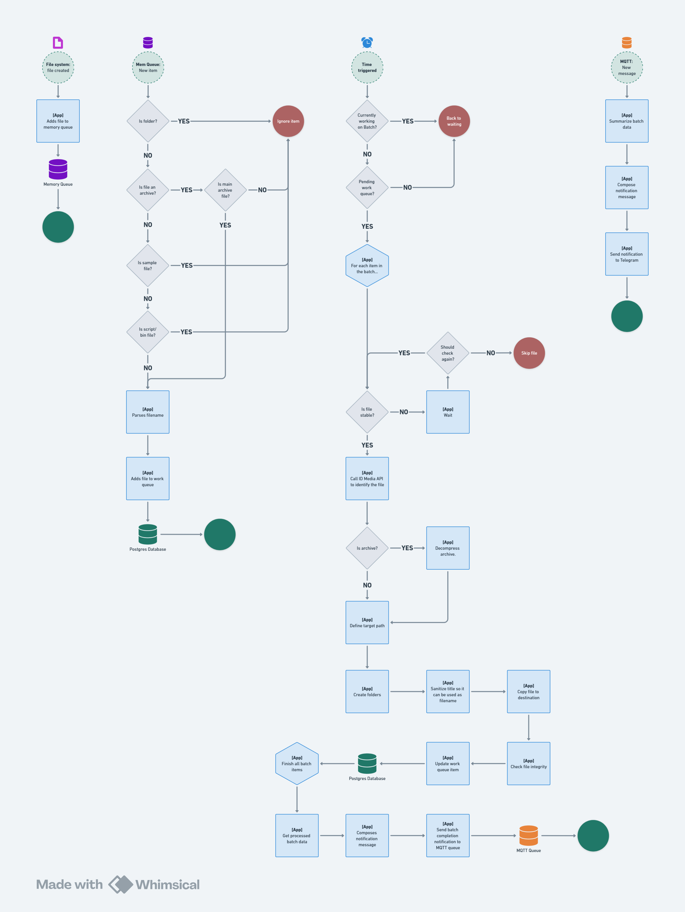

# Scene Media Organizer (SMO)

A Python-based file monitoring and media organization system that automatically processes video files and archives,
organizing them into structured directories based on media metadata.

### Request flow
The chart below shows a simplified, happy-path request flow.


## How does it work?
We have four major elements in this application:
1. File system monitor: Triggered whenever a file/folder is created.
2. Memory Queue: To temporarily hold the files that we receive in the events
3. Activity Tracker: Logs all the activity happening in the system, so it can be closely monitored.
4. MQTT Queue: To decouple the file processing from the notification system.

### File Processing
- Files created under `WATCH_FOLDER` are detected by a watchdog observer (`main.py`).
- Each file event is enqueued in memory and normalized (`src/queue_worker.py`):
  - Directories are ignored.
  - Archives are detected, and only the main/first volume is considered (multipart volumes are ignored: we just need the main file to decompress it).
  - Files named like “sample” or executables are ignored.
  - Remaining items are persisted to the Postgres-backed work queue as `PENDING` via `WorkQueueManager`.
- The batch processor (`src/batch_processor.py`) continuously fetches the next batch and processes each item:
  - Wait until the file is stable (size unchanged for a short period).
  - Identify media via the Media Identifier API (`API_URL`). Items without valid metadata are marked `FAILED_ID`.
  - If the item is an archive, it is decompressed in place (supports 7z/rar/zip/tar/gz/bz2/xz); then the item is marked `DONE`. The new file will be processed in the next batch automatically.
  - If it is a video file, the destination is resolved from metadata:
    - Movies → `MOVIES_BASE_FOLDER/<Title>--<Year>` (year optional)
    - TV → `SERIES_BASE_FOLDER/<Title>/SeasonXX`
  - The file is copied to the destination; on success the item is marked `DONE`, otherwise it will be retried once.
  - At the end of the batch, any straggling `WORKING` items are moved back to `PENDING`, so we can give it one more try, the batch is closed, and a verification step compares source/destination (size and SHA-256) for `DONE` items.
  - A completion payload (items, verification result and details) is published to MQTT for notifications.

### Notification System
- A background consumer (`src/notification_receiver.py`) subscribes to `MQTT_BASE_TOPIC` using `NotificationRepository` (MQTT).
- On batch-complete messages it:
  - Deserializes the payload and computes insights (totals, per-status counts, archives, destination set count, failures, unique filenames) and a summary.
  - Renders a concise, HTML-formatted report, including verification results (size/hash checks).
  - Splits long messages to respect Telegram limits and sends them via the Telegram Bot API (`TELEGRAM_*` vars) using `send_telegram_message`.

## Requirements

### External dependencies
- Postgres database
- [media identifier api](https://github.com/brenordv/media-identifier-api)
- Rar command line tool

#### Local prerequisites
- [uv](https://docs.astral.sh/uv/) manages the dependencies and runs the app.
- A 7-Zip binary (`7zz`) on `PATH`, or `UNRAR_PATH` pointing at one, for archive extraction.

No C build toolchain or `libpq` is needed: `psycopg[binary]` bundles its own libpq and `uv` builds the environment straight from the lockfile.

## Configuration

Both entry points (`main.py` and `on_demand.py`) read configuration from three sources, highest precedence first:

1. Command-line flags (below). A secret manager can inject secrets this way.
2. Process environment variables.
3. A `.env` file, loaded last and only for values not already set.

The `.env` fallback never overrides a value already in the environment. A variable set to an empty string still counts as set, so inside a container prefer real environment values; leave a variable unset (rather than `""`) if you want `.env` to fill it.

### Command-line flags

Each flag sets the matching environment variable:

| Flag                   | Variable                      | Purpose                                          |
|------------------------|-------------------------------|--------------------------------------------------|
| `--watch-folder`       | `WATCH_FOLDER`                | Directory to monitor for new files               |
| `--movies-base-folder` | `MOVIES_BASE_FOLDER`          | Base directory for movies                        |
| `--series-base-folder` | `SERIES_BASE_FOLDER`          | Base directory for TV series                     |
| `--postgres-host`      | `POSTGRES_HOST`               | Postgres host                                    |
| `--postgres-port`      | `POSTGRES_PORT`               | Postgres port (default `5432`)                   |
| `--postgres-user`      | `POSTGRES_USER`               | Postgres user                                    |
| `--postgres-password`  | `POSTGRES_PASSWORD`           | Postgres password                                |
| `--postgres-db`        | `POSTGRES_DB`                 | Postgres database name (default `smo_watchdog`)  |
| `--api-url`            | `API_URL`                     | Media identifier API URL                         |
| `--mqtt-host`          | `MQTT_HOST`                   | MQTT host                                        |
| `--mqtt-port`          | `MQTT_PORT`                   | MQTT port (default `1883`)                       |
| `--mqtt-base-topic`    | `MQTT_BASE_TOPIC`             | Base topic for MQTT messages                     |
| `--mqtt-client-id`     | `MQTT_CLIENT_ID`              | MQTT client id                                   |
| `--mqtt-username`      | `MQTT_USERNAME`               | MQTT username (omit if the broker needs no auth) |
| `--mqtt-password`      | `MQTT_PASSWORD`               | MQTT password                                    |
| `--telegram-bot-token` | `TELEGRAM_BOT_TOKEN`          | Telegram bot token                               |
| `--telegram-chat-id`   | `TELEGRAM_CHAT_ID`            | Telegram chat id                                 |
| `--otel-endpoint`      | `OTEL_EXPORTER_OTLP_ENDPOINT` | OTLP exporter endpoint (required)                |
| `--unrar-path`         | `UNRAR_PATH`                  | Archive-extraction binary (defaults to `7zz`)    |

`--env-file PATH` loads fallback values from `PATH` instead of `./.env`. `on_demand.py` also accepts `-y`/`--yes` to skip its confirmation prompt. Run either entry point with `--help` to list every flag.

Values passed as CLI arguments are visible in the process list while the script runs, and interactive shells keep them in history. On a single-user server fed by a local secret manager this is usually fine; when it is not, have the secret manager write a transient file and pass `--env-file`.

### Tuning variables (no flag)

These stay on the environment or `.env`; they carry no secrets:

- `MQTT_BASE_TOPIC` also has a flag above; the rest below have none.
- `TELEGRAM_PARSE_MODE` - Telegram parse mode. Defaults to `HTML`.
- `TELEGRAM_DISABLE_WEB_PREVIEW` - Defaults to `false`.
- `TELEGRAM_DISABLE_NOTIFICATION` - Defaults to `false`.
- `WATCHDOG_CHANGE_DEST_OWNERSHIP_ON_COPY` - Defaults to `false`.

## Operational behavior

Run the container with a restart policy (`unless-stopped` or `on-failure`). The three worker threads restart themselves with capped exponential backoff when they crash, but if the file-system observer dies the process exits on purpose so the restart policy brings the whole service back.

Terminal failure statuses an item can land on:

- `FAILED_ID` - the identifier returned no usable metadata.
- `FAILED_MISSING` - the source file vanished before it could be processed.
- `FAILED_MAX_ATTEMPTS` - the item failed 5 processing attempts. Transient conditions (identifier unreachable, file still being written) refund the attempt, so only genuine repeated failures reach the cap.

All three appear in the batch's Telegram report. To re-queue an item, set `status = 'PENDING', attempts = 0` on its `work_queue` row.

One exception to the report: `on_demand.py` sweeps orphaned `WORKING` items (left by an earlier crash) back to pending before it builds a batch, and any it caps there are logged to the console only, not to Telegram. The in-batch cap during normal processing does reach the Telegram report.

### Resumable maintenance runs

Interrupting `on_demand.py` (Ctrl+C, a crash, or a kill) leaves the batch open. Re-running the same command resumes that batch: it redoes the file that was mid-processing, skips items already completed, and sends one final report covering the whole batch, including the items finished before the interruption. Pressing Ctrl+C at the confirmation prompt, before any work starts, aborts without touching the database.

A few consequences worth knowing:

- Interrupted pickups do not consume the attempt cap: an item that was only picked up and then interrupted has its attempt refunded on resume. For scheduled use this is a trade-off. A non-interactive run (`--yes`, for example from cron) that keeps crashing on the same poison item keeps refunding it and never reaches `FAILED_MAX_ATTEMPTS`. The watchdog service still enforces the strict cap; the `on_demand` path deliberately does not.
- Resuming a batch left behind by a crashed *service* container works, but that batch's already-completed items were recorded with in-container paths (`/watch`, `/movies`, `/series`). If those paths do not resolve on the machine running `on_demand.py`, the final report flags them as verification failures even though the copies are fine.
- The "stop the container service first" advice above still applies: resuming a batch the running service currently owns can double-process items.

## Usage

1. Provide configuration as CLI flags, environment variables, or a `.env` file (see Configuration).
2. Ensure Postgres is reachable.
3. Sync the environment and start the watchdog:
   ```bash
   uv sync
   uv run python main.py
   ```
`uv run` executes inside the project environment, so there is no virtual environment to activate. The app then monitors the watch folder and processes new media files and archives as they arrive.

For maintenance runs:
```bash
uv run python on_demand.py batch      # process everything already pending
uv run python on_demand.py missing    # queue on-disk files not yet tracked, then process
```
Add `--yes` to skip the confirmation prompt in non-interactive runs.

Any flag from the [Configuration](#command-line-flags) table can go on the command line, including the secrets. This is the "a secret manager can inject secrets this way" path: the manager resolves each value and hands it to `on_demand.py` as a flag. A batch run with the sensitive values (Postgres password, MQTT password, Telegram bot token) passed inline:

```bash
uv run python on_demand.py batch \
  --watch-folder /data/watch \
  --movies-base-folder /data/movies \
  --series-base-folder /data/series \
  --api-url http://media-identifier:8080 \
  --otel-endpoint http://otel-collector:4317 \
  --postgres-host db \
  --postgres-user smo \
  --postgres-password 'REPLACE_WITH_PG_PASSWORD' \
  --mqtt-host mqtt \
  --mqtt-username smo \
  --mqtt-password 'REPLACE_WITH_MQTT_PASSWORD' \
  --telegram-bot-token 'REPLACE_WITH_BOT_TOKEN' \
  --telegram-chat-id 123456789 \
  --yes
```

Swap `batch` for `missing` to sweep on-disk files into the queue first. Remember that inline flags are visible in the process list while the run lasts and that an interactive shell keeps them in history; when that matters, have the secret manager write a transient file and pass `--env-file` instead (see [Configuration](#configuration)).

### Convenience scripts
- Linux: `start.sh`
- Windows: `start.bat`

Each checks that `uv` is installed, runs `uv sync`, and starts `main.py`. They no longer need to be sourced.